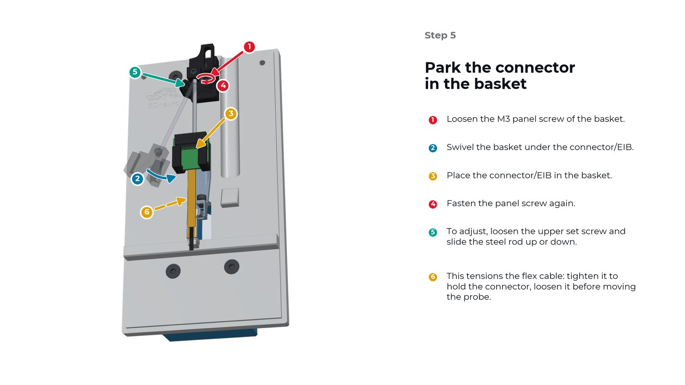
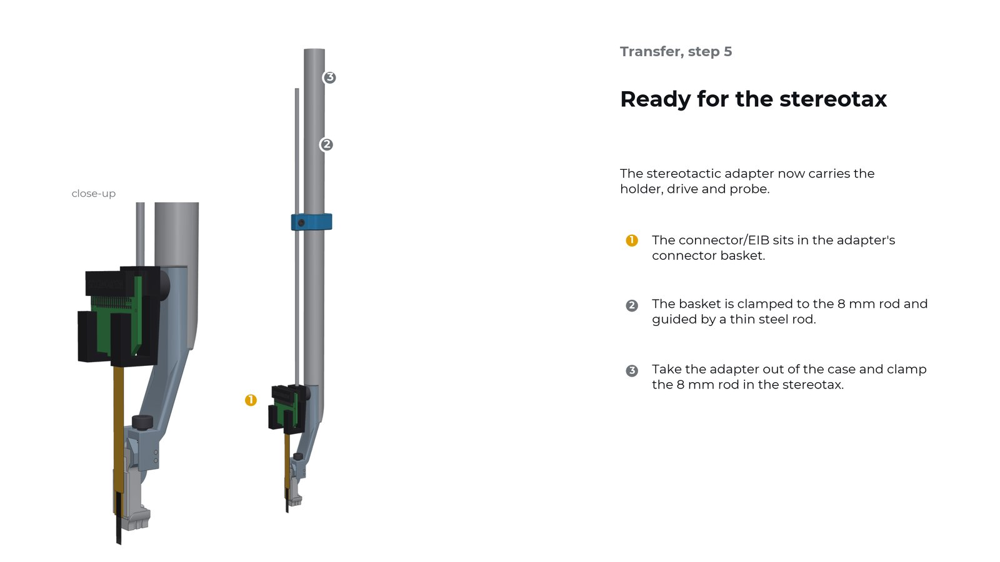
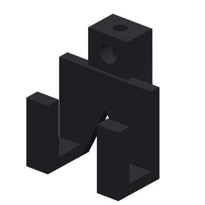

# R2 connector baskets

3D-printable connector baskets for the **R2metal implantation system** by 3Dneuro.

## The R2metal implantation system

The R2metal implantation system covers the whole life of a probe mounted on an R2drive or R2rail: preparation, implantation, explantation, clean-up and storage. It has three main parts:

- a **metal holder** of micromachined stainless steel that clamps the drive from the side, with the clamp screw tightened from above;
- a **stereotactic adapter**, an 8 mm rod that goes into the stereotax;
- a **protective case** where probes are loaded, stored and transferred.

Full documentation: <https://recover-reuse.it/>

## The basket system

A probe's flex cable ends in a connector or an electrode interface board (EIB). The gold standard for holding them during implantations or between experiments range from rubber bands to blu tack. The connector baskets aim to fix that. 
They hold that connector/EIB, and allow to tension it in the R2 metal case and on the stereotax, to so the connector is held stably but the flex cable never pulls on the probe. There are two baskets (images from [R2 system documentation](https://recover-reuse.it)):

### Basket in the R2 metal case

### Basket on the R2 metal implantation system stereotactic adapter

Sliding a basket along its rod sets the flex-cable tension: taut enough to hold the connector, slack before the probe or connector is moved.

## The standard basket

The standard basket is a **generic basket** that fits many high-density connectors. It is the basket shown in the renderings above and the one supplied with the system. The connector/EIB sits between its two arms; the basket slides onto its stainless-steel rod through the bore at the top and is fixed with an M3 set screw.

| Dimension | Value |
| --- | --- |
| Overall width | 14 mm |
| Connector opening (between the arms) | 7.5 mm |
| Arm depth | 9 mm |
| Rod bore | Ø1.75 mm |
| Set-screw thread | M3 × 0.5, 6H |

Files, in [`01_standard_basket/`](01_standard_basket/):

## Customisation

You can adapt the basket system to your probe in two ways.

### 1. Modify or print your own basket

1. Download the STL, or modify the STEP or Fusion 360 file for your connector/EIB. Keep the interface to the rod unchanged (Ø1.75 mm bore, M3 set-screw hole) and change only the part that holds the connector.
2. Print it at 100% scale and remove all support material.
3. Cut the thread with an M3 tap or use a threaded insert (recommended for FDM prints).
4. Check that the basket slides onto its rod without play and without force.
5. Loosen the set screw that holds the old basket, slide it off, slide the new one on, set its height and tighten the set screw.

Try a new design with a dummy connector or an old probe before using it with a real probe.

### 2. Modify the stainless-steel rod

The basket rides on a 1.5mm stainless-steel rod, which you can adapt to your flex cable:

- **Length:** cut a shorter rod, or use a longer one, to match the length of the flex cable.
- **Shape:** bend the rod to bring the connector to a different position, for example to clear other implants or to route the flex cable more gently. For bending, you might consider replacing the stainless steel rod with a softer metal, for example a brass rod.

Check that the modified rod still passes through its sleeve or holder and that the basket can still slide far enough to tension the flex cable.
